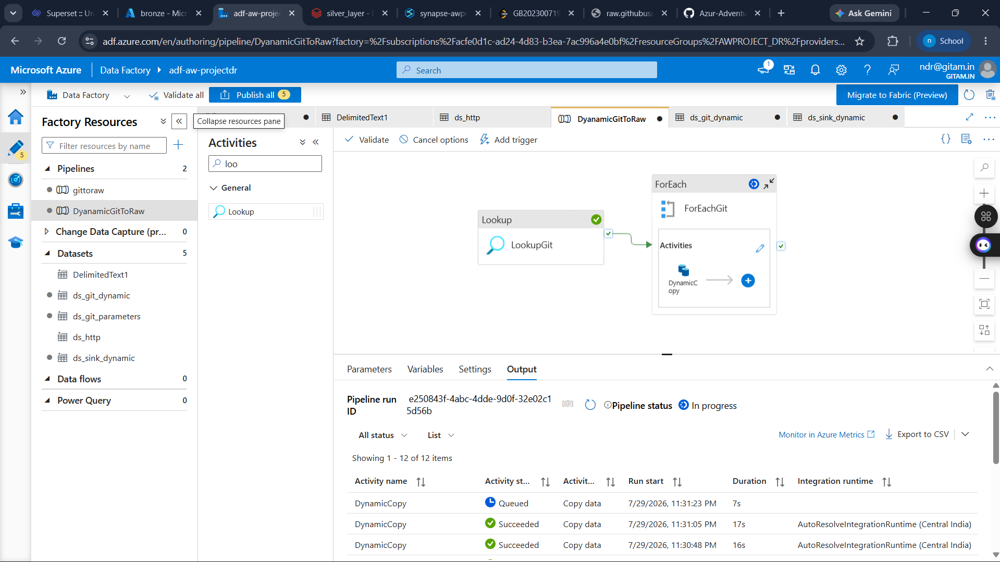

# Azure Data Factory

This folder contains the Azure Data Factory pipeline used to ingest multiple AdventureWorks datasets dynamically from GitHub into Azure Data Lake Storage.

## Pipeline Workflow

Lookup Activity
↓
ForEach Activity
↓
Dynamic Copy Activity
↓
Azure Data Lake Storage (Bronze Layer)

## Features

- Dynamic pipeline using Lookup activity
- ForEach loop for multiple datasets
- Parameterized source and sink datasets
- Automated ingestion into ADLS Gen2

## Technologies

- Azure Data Factory
- Lookup Activity
- ForEach Activity
- Copy Activity
- Dynamic Parameters
- Azure Data Lake Storage Gen2

  
