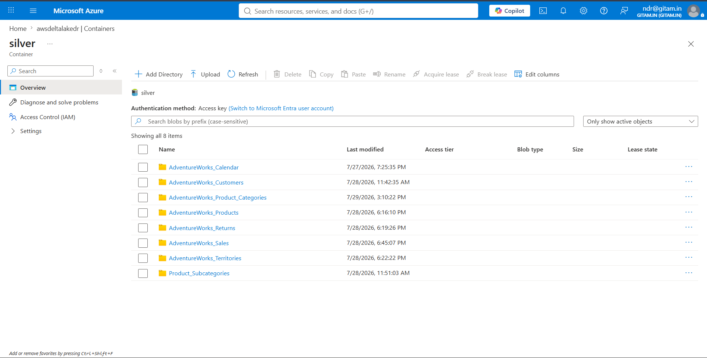

# Azure Databricks

This folder contains the PySpark notebook used to transform the AdventureWorks dataset.

## Files

- **silver_layer.py** – PySpark notebook for data transformation.
- **Silver_Layer_ADLS.png** – Processed datasets written to the Silver layer in Azure Data Lake Storage Gen2.

## Technologies Used

- Azure Databricks
- PySpark
- Delta Lake
- Azure Data Lake Storage Gen2

  
