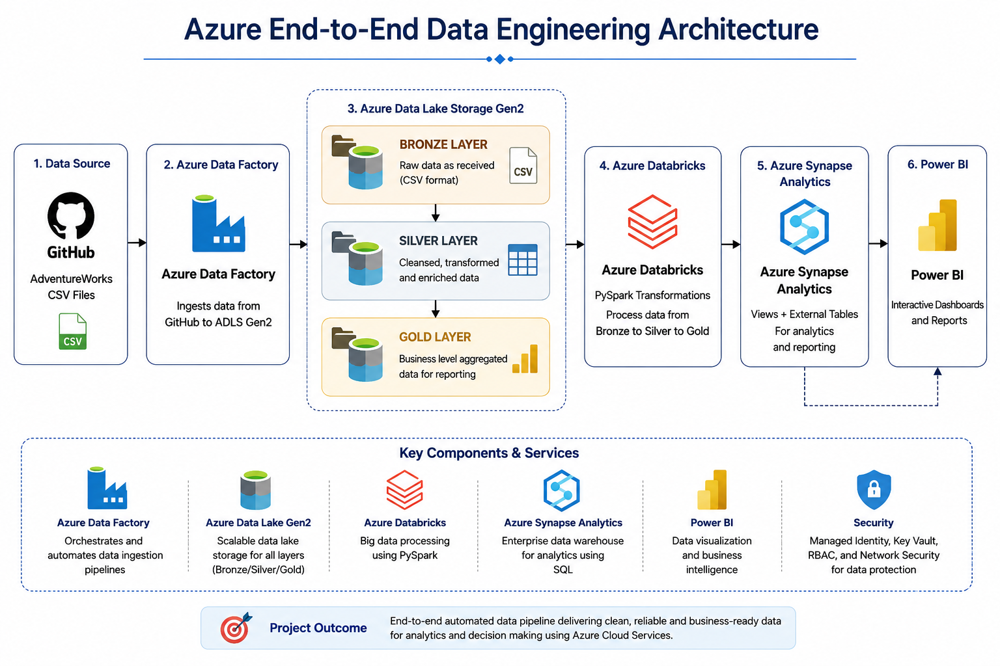
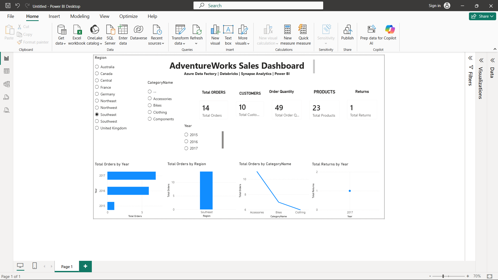
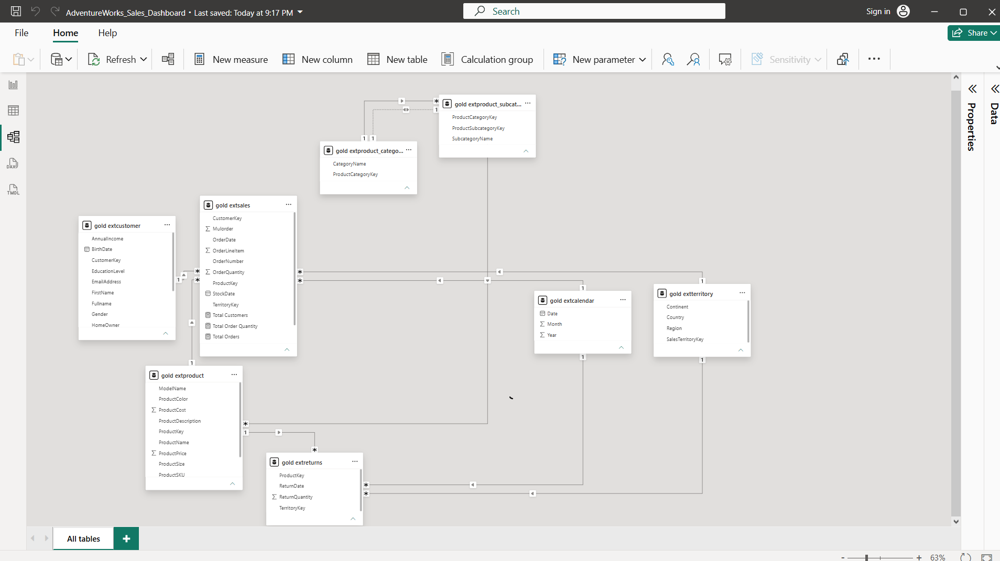

# Azure End-to-End Data Engineering Project

##  Project Overview

This project demonstrates an end-to-end Azure Data Engineering pipeline built using Microsoft Azure services. The pipeline ingests data from GitHub, stores it in Azure Data Lake Storage, transforms it using Azure Databricks, creates analytical views using Azure Synapse Analytics, and visualizes insights using Power BI.

The project follows the Medallion Architecture (Bronze → Silver → Gold) to build a scalable and analytics-ready data platform.

---

##  Architecture



---

## Tech Stack

| Service | Purpose |
|----------|----------|
| Azure Data Factory | Data Ingestion |
| Azure Data Lake Storage Gen2 | Data Storage |
| Azure Databricks (PySpark) | Data Transformation |
| Azure Synapse Analytics | SQL Views & External Tables |
| Power BI | Dashboard & Reporting |
| GitHub | Source Data & Version Control |

---

##  Project Workflow

```
GitHub CSV Files
        │
        ▼
Azure Data Factory
        │
        ▼
ADLS Gen2 (Bronze Layer)
        │
        ▼
Azure Databricks (PySpark)
        │
        ▼
ADLS Gen2 (Silver Layer)
        │
        ▼
Azure Synapse Analytics
(Gold Views + External Tables)
        │
        ▼
Power BI Dashboard
```

---

##  Repository Structure

```
Azur-Adventure-project
│
├── Azure Data Factory
├── Databricks
├── Synapse SQL
├── Power BI
├── Architecture
├── Screenshots
└── README.md
```

---

##  Power BI Dashboard



### Dashboard Features

- KPI Cards
  - Total Orders
  - Total Customers
  - Total Products
  - Total Returns
  - Total Order Quantity

- Interactive Filters
  - Region
  - Category
  - Year

- Visualizations
  - Orders by Year
  - Orders by Region
  - Orders by Category
  - Returns by Year

---

##  Project Screenshots

### Star Schema



---

##  Key Learnings

- Built an end-to-end Azure Data Engineering pipeline.
- Implemented Medallion Architecture (Bronze → Silver → Gold).
- Automated data ingestion using Azure Data Factory.
- Performed data transformations using PySpark in Azure Databricks.
- Created SQL Views and External Tables using Azure Synapse Analytics.
- Designed an interactive Power BI dashboard with KPIs, charts, and slicers.
- Applied data modeling using a Star Schema.
- Managed project version control using GitHub.

---

##  Future Improvements

- Incremental Data Loading
- CI/CD using Azure DevOps
- Parameterized Pipelines
- Data Quality Validation
- Monitoring & Alerting
- Row-Level Security in Power BI

---

##  Author

**Nagaraj D R**

B.Tech CSE | Data Engineering Enthusiast

GitHub: https://github.com/Nagaraj212005
