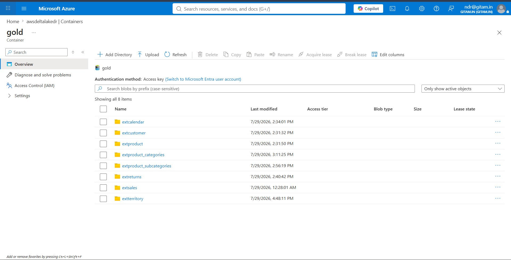
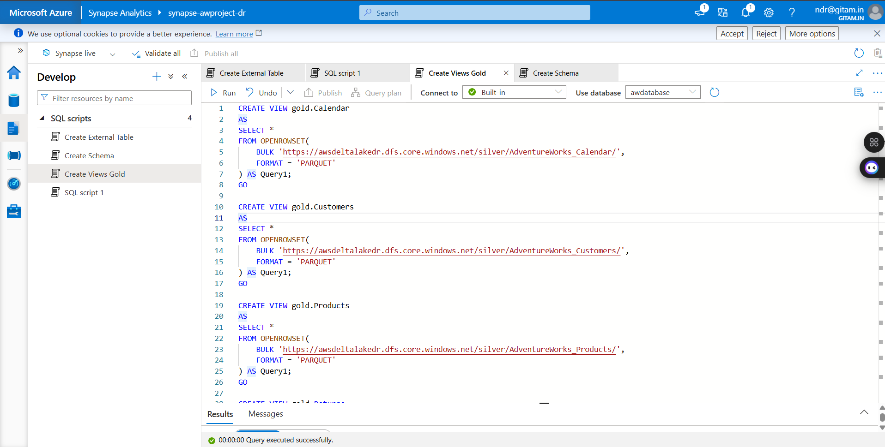

# Azure Synapse Analytics

This folder contains SQL scripts used in Azure Synapse Analytics to expose the transformed data stored in Azure Data Lake Storage.

## Files

- Create_Views.sql
- Create_External_Tables.sql
- Synapse_Views.png
- External_Tables.png

## Technologies

- Azure Synapse Analytics
- Serverless SQL Pool
- External Tables
- OPENROWSET
- Parquet

   
   
